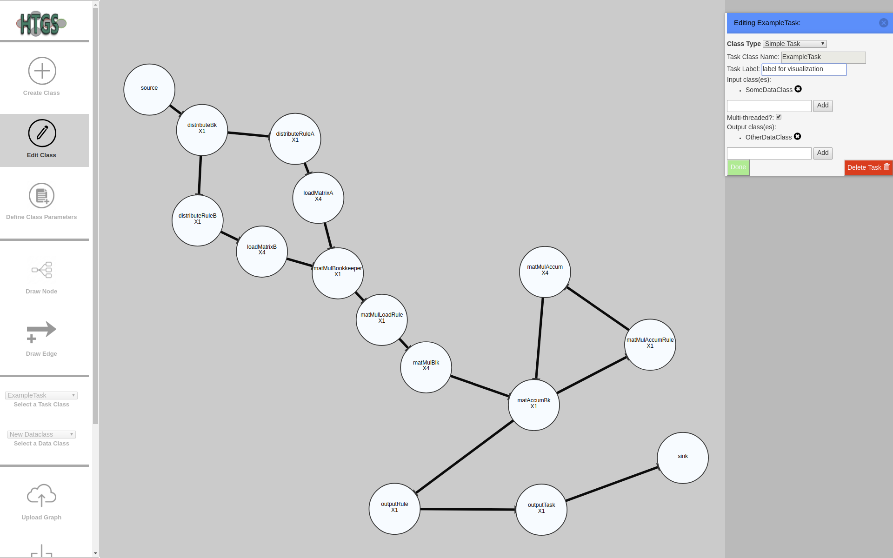
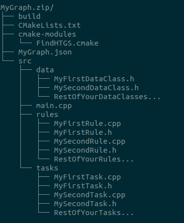

# HTGS-Generator

Interactive tool for creating task graphs and generating
[HTGS](https://github.com/usnistgov/HTGS) 
boilerplate code from the created graph.  

Made using HTML5, CSS, Ecmascript 2017, JQuery 3.3.1, 
d3.js v3, and some javascript plugins and tools ([izimodal](http://izimodal.marcelodolce.com/), 
[Notifications](https://github.com/JamieLivingstone/Notifications), 
and [JSZip](https://stuk.github.io/jszip/)).  
*This tool was built on top of the 
[directed graph creator tool](https://github.com/cjrd/directed-graph-creator).* 

Demo: [this isn't hosted anywhere yet](#)

Interface screenshot with example graph:  

### Interface and Operation:  
* **Toolbar** (left): 
    * Create Class:
        * Allows you to define a new Task Class that will be generated if used
        * Set properties that determine the class definition code that will be generated
        * Error checks for repeated class names, correct input/output for task, 
        and invalid C++ identifiers
        * After specifying the type of your task (simple, bookkeeper rule, etc.) 
        you can configure:
            * For Simple Tasks:
                * Name for your class (use UpperCamelCase or Pascal Case for all classes)
                * A label that appears for tasks of this class when visualizing 
                the generated task graph 
                * Name of the input and output classes (press down arrow for 
                a list of existing classes) (use UpperCamelCase for I/O too)
                * Whether your Task Class will use a multi-threaded constructor or 
                the default single threaded one
            * For Bookkeeper Rules: 
                * same as above, but no checkmark for threading
        
    * Edit Task:
        * Edit some parameters of the currently selected Task 
        * Validates your edits and highlights any errors they might have caused in the graph
        * Here you can delete an entire task class and all of its instances
        * Cannot edit: 
            * The type of the task
            * Name of the task (for now)

    * Define Class Parameters:
        * Define parameters that will be generated for the selected dataclass 
        * You can create a new Dataclass if using the 'new Dataclass' option in the 
        selection
        
    * Draw Task:
        * Toggle for drawing a node instance of the selected Task Class in the main window  
        
    * Draw Edge:
        * Toggle for drawing edges between existing nodes in the main window  
        
    * Select a Task Class:
        * Let's you select a Task Class to edit or draw instances  

    * Select a Data Class:
        * Let's you select a Data Class so you can define its parameters
        
    * Upload Graph:
        * Upload a JSON file from a previosly created graph. Will load the visual 
        graph elements 
        in the main and load the graph into the current interface 
        
    *  Generate Graph:
        * Validates your graph. If the graph is valid it will display a window with a 
        download button for a zip file of your graph. Otherwise it displays a window with 
        a list of errors.  

    * Save Graph:
        * Downloads the current state of your graph as a JSON. Doesn't validate errors. 
        
    * Delete Graph:
        * Deletes **all** graph information and elements. Asks for confirmation.
  
* **Main Window** (center):
    * `Click` and `Drag` with mouse to move around the whole graph 
    * `Scroll` with mouse wheel to zoom the graph
    * `Click` and `Drag` with mouse to move around nodes
    * `Click` on a node or edge to select it
    * `Ctrl+f` when focused on the main window. A prompt will ask you for the name of an 
    instance. Any matches will be highlighted in the graph.
    * `Ctrl+u` when focused on the main window. Will clear all highlighted search results.  
    * None of the following actions apply to the **source** and **sink** nodes since 
    they are simply explicit, visual representations of the Task Graph input and output, 
    and are not tasks instances.
    * With `'Draw Task' toggled`, `shift-click` on graph to create a node instance. 
    This will pop-up the task class instance menu on the right where you can define 
    node properties.
    * With `'Draw Edge' toggled`, `shift-click` on a node and then drag 
    to another node to connect them with a directed edge. The edge will be added if 
    it's valid, not duplicated, and meets the conditions for the type of tasks being connected
    * `Shift-click` on a node to edit its properties (not all parameters are editable)
    * `Shift-click` on an edge to see the edge source, target, and the Data Class 
    it carries in the edge data window on the right
    * With a node or edge selected, press `Backspace` or `Delete` to remove it

* **Code Generation**:
    * If you create and download a valid graph, then the generated code 
    should have this general structure:  
    
    * Each Data Class generates a header file (.h) in src/data/ that inherits 
    the HTGS IData object
    * Each Simple Task Class generates in src/tasks/:
        * a header file that inherits the HTGS ITask object with the user-defined input/output
        * an implementation file (.cpp) that implements the specified constructor 
        and some interface functions
    * Each Rule Task Class generates in src/rules/:
        * a header file that inherits the HTGS IRule object with the user-defined input/output
        * an implementation file (.cpp) that implements the constructor 
        and some interface functions
    * A /src/main.cpp file that declares:
        * the drawn node instances and edges
        * the graph and configures its input, output, and task consumer and producers
        * A rudimentary HTGS runtime
    * CMakeLists.txt enables compilation and execution as an HTGS project
    * FindHTGS.cmake that checks for dependencies
    * A JSON file that holds all the graph metadata
    * An empty build directory as a suggested place to build your project

### Requirements:

* Working familiarity with how [HTGS](https://github.com/usnistgov/HTGS) works
* This tool uses some Ecmascript 2017 features.  
This means you need a relatively modern browsers to use this tool properly.   
I recommend you use a Chromium based browser since most of the testing was performed with Chromium.  
Firefox never gave me any issues either, but my testing with Firefox was more limited.  
General browser requirements according to MDN web docs (untested):
    * Edge >= 14 (no IE support)
    * Firefox >= 47 
    * Chrome >= 54
    * Safari >= 10.1 
    * Opera >= 41
    
* HTGS dependencies:
    * g++/gcc >= 4.8.4
    * pthreads
    * doxygen (optional)
    
* HTGS [source code](https://github.com/usnistgov/HTGS)

### Installing and running:  

* Clone or download this repo
* Use as a website (recommended): 
    * One way is to run `python -m SimpleHTTPServer 8000` in this directory
    * then navigate to localhost:8000 in your browser
* Use as a native app (dev only. builds, but interface isn't running correctly):
    * requires npm and nodejs
    * The app is very barebones  
    (I mean **VERY**: close button doesn't work, you have to force quit the app in all OS, 
    modal windows aren't working at all, and icon was improvised quickly)
    * I defined [electron-packager](https://github.com/electron-userland/electron-packager) 
    targets in the package.json for 64 bit:
        * Linux (app image)
        * macOS
        * Windows
    * run `npm install` on this directory to install dependencies
    * After this you can run electron ./main.js to run the app
    * Alternitavely you can build the apps:
        * run `npm run package-<OS>` 
        with no braces between OS and OS is one of: mac, linux, win
    * Afterwards you can find the app in the build/<yourOS> directory
